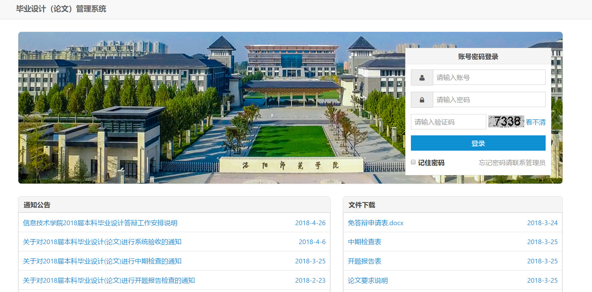
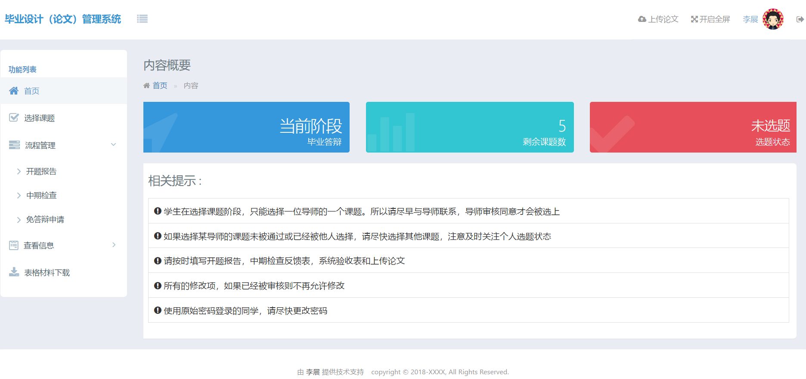
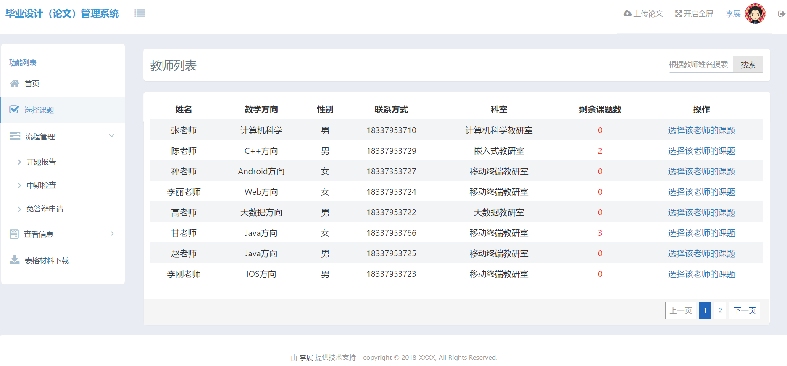
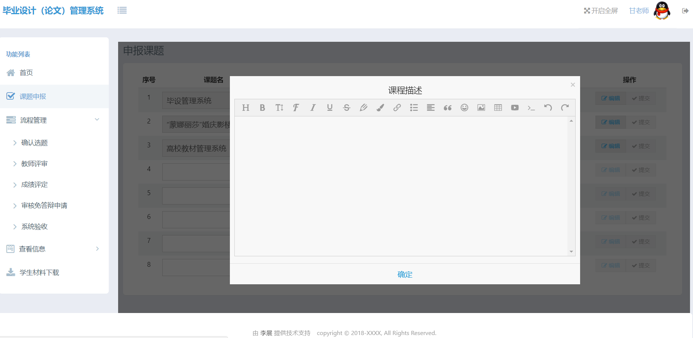

# graduation
毕业设计管理系统可以分为五个模块：登录模块，选题模块，信息管理模块，流程管理模块，文件管理模块。
- 该系统在技术上使用Spring+SpringMVC+MyBatis整合框架作为后台开发框架，AmazeUI作为前端开发框架。
并使用Ehcache作为项目的缓存，druid作为项目的数据库连接池，使用FreeMarker实现word的导出，使用Shiro完成项目的登录认证，数据库使用的则是MySQL。
- 该系统可以分为三类角色：学生，教师，教务管理员。
- 该系统前端界面使用纯HTML实现，与后台的交互则都是通过Ajax完成。
## 登录模块
登录模块主要完成教务管理员，教师，学生用户的登录功能，每个角色登录之后会看到不同的操作界面。
## 选题模块
选题模块主要完成师生双选这一业务流程。
## 信息管理模块
信息管理模块主要完成对各种信息的crud操作。
## 流程管理模块
流程管理主要完成对开题报告，中期检查，免答辩申请，验收/答辩，论文审核，盲审的流程的管理。
## 文件管理模块
文件管理模块主要对文件的上传与下载。

## 部分界面
- 登录(学生,教师统一使用该登录界面进行登录)

- 主页(主页可以看到一些内容概要与相关提示)

- 教师列表(通过选择某一教师进而选择其课题)

- 申报课题(教师只有填写课题名之后才可以申报课题)
